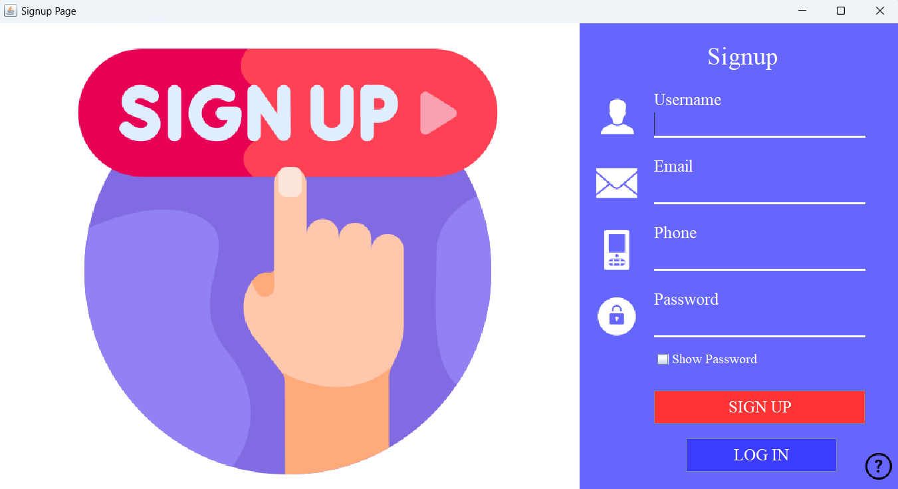
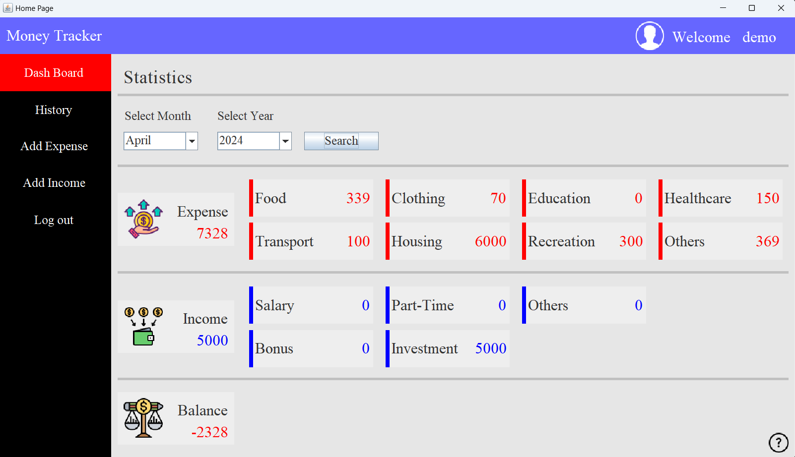
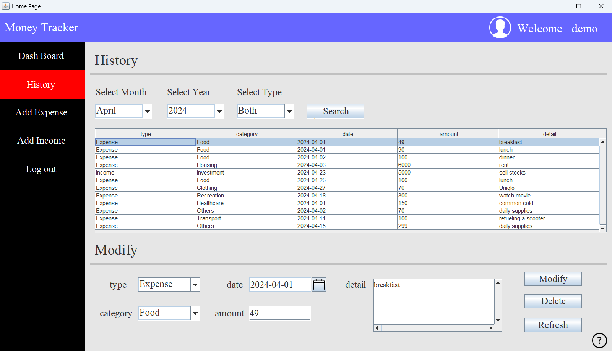
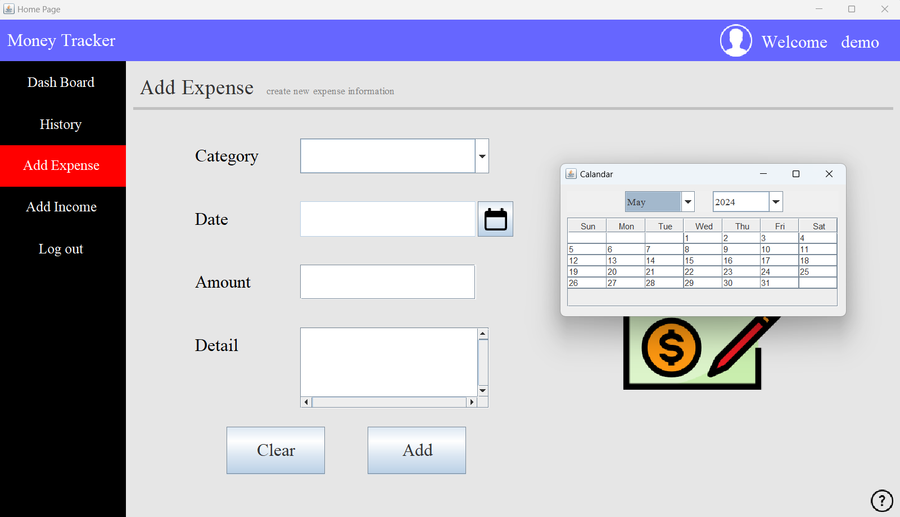
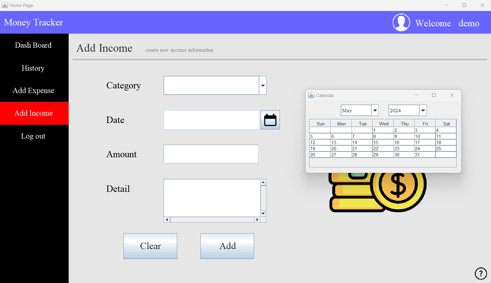

# MoneyTracker
* A java window application project.
* Record income and expenses.
* Use MVC pattern.
* Support CRUD operations.


## About
An easy-to-use money tracking window application where users can log in, register, record incomes and expenses, view/search/filter/modify financial records and view financial summaries according to the selected year and month.


## Software And Tools Required 
* Java
* Apache Maven 
* MySQL Server
* MySQL Workbench
* Eclipse EE or Visual Studio Code


## Run In Eclipse EE
1. Download development tool
    * IDE: [Eclipse EE](https://www.eclipse.org/downloads/packages/release/kepler/sr2/eclipse-ide-java-ee-developers)
    * Database: [MySQL](https://www.mysql.com/downloads/)
2. Open Eclipse EE.
3. Clone this repository
    * Click On File > Import > Git > Projects From Git(with smart import) > Next
    * Clone URI > Next > Paste `https://github.com/JeepWay/MoneyTracker.git` in URI > Next
    * Select master Branch > Next > Select Destination Directory > Next
    * Ckeckout Import Source > Finish
4. Create MySQL database
    * Open MySQL Command Prompt or MySQL Workbench
    * Login to the administrator user as : `mysql -u <adminusername> -p`
    * Enter Password if asked
    * Copy paste the MySQL commands in [`setup/CreateUsers.sql`](/setup/CreateUsers.sql) and [`setup/CreateRecords.sql`](/setup/CreateRecords.sql) to the Prompt
    * Make sure you have get response after enter the commands, e.g., search user 
5. Configure MySQL
    * Open `src/main/resources/application.properties` file
    * Modify the value of database details according to your installed MySQL admin user setting. db.name is refer to the database of this project, which is default to `moneytracker`.
6. Build project
    * Right Click on Project > Maven > Update Project... > Click Force Update > Select moneytracker > OK
    * Right Click on Project > Run as > Maven Build > Paste `clean install` in the goals field > apply > run
    * Check the output in console and make ensure success build.
7. Run application
    * Right Click on Project > Run as > Maven Build > Paste `exec:java` in the goals field > apply > run
    * For simplicity, you can just open terminal, then paste `mvn exec:java` command 
8. Login
    * The default username and password is `demo` and `8888`
    * If you want to create the new user, just click signup page to create new user information


## Run In Visual Studio Code
1. Download development tool
    * IDE: [Visual Studio Code](https://code.visualstudio.com/download)
    * Database: [MySQL](https://www.mysql.com/downloads/)
2. Clone this repository
    * Open terminal 
    * Paste `git clone https://github.com/JeepWay/MoneyTracker.git` in terminal
    * `cd MoneyTracker` 
3. Create MySQL database
    * Open MySQL Command Prompt or MySQL Workbench
    * Login to the administrator user as : `mysql -u <adminusername> -p`
    * Enter Password if asked
    * Copy paste the MySQL commands in [`setup/CreateUsers.sql`](/setup/CreateUsers.sql) and [`setup/CreateRecords.sql`](/setup/CreateRecords.sql) to the Prompt
    * Make sure you have get response after enter the commands, e.g., search user 
4. Configure MySQL
    * Open `src/main/resources/application.properties` file
    * Modify the value of database details according to your installed MySQL admin user setting. db.name is refer to the database of this project, which is default to `moneytracker`.
5. Build project
    * Paste `mvn clean install` in terminal
    * Check the output of `mvn clean install` and ensure success build.
6. Run application
    * Paste `mvn exec:java` in terminal
7. Login
    * The default username and password is `demo` and `8888`
    * If you want to create the new user, just click signup page to create new user information

## Code tree 
```bash
├── java.com.jeepway
|   ├── constant
|   |   ├── CommonConstants.java
|   |   ├── DBConstants.java
|   |   ├── RecordConstants.java
|   |   ├── UserConstants.java
|   ├── control
|   |   ├── HomePage.java
|   |   ├── LoginPage.java
|   |   ├── PanelCardAddExpense.java
|   |   ├── PanelCardAddIncome.java
|   |   ├── PanelCardDashBoard.java
|   |   ├── PanelCardHistory.java
|   |   ├── SignupPage.java
|   |   ├── SwingCalendar.java
|   ├── model
|   |   ├── Record.java
|   |   ├── User.java
|   ├── utils
|   |   ├── DBConnection.java
|   |   ├── DBRecordsService.java
|   |   ├── DBUserService.java
|   ├── view
|   |   ├── HomePageUI.java
|   |   ├── LoginPageUI.java
|   |   ├── PanelCardAddExpenseUI.java
|   |   ├── PanelCardAddIncomeUI.java
|   |   ├── PanelCardDashBoardUI.java
|   |   ├── PanelCardHistoryUI.java
|   |   ├── SignupPageUI.java
├── resources
|   ├── icon
|   |   ├── *.png
|   ├── application.properties
```

`model` folder contains the encapsulation of users and records tables in database.

`view` folder contains UI files constructed with [WindowBuilder](https://eclipse.dev/windowbuilder/) plug-in.

`control` folder contains the controller implementation of UI files, e.g., add ActionListener, MouseListener, call methods in `utils` folder to get data from database and then display on UI.

`utils` folder contains the methods to connect to MySQL database. These methods are accessible for controller call to get data from database.

`constant` folder contains some constant variables frequently used.  


## Application Tour
You can see the traditional chinese tour in [here](https://hackmd.io/@ORAzzQWQ10/BJXwQZWIh).

Furthermore, you can also click the question marks in window application which is linked to the the traditional chinese tour.

If your are familiar with english, we also provide the english version of the tour in [`MoneyTrackerTour.en-US.md`](MoneyTrackerTour.en-US.md)

## Application Snapshot
<p align="center">

</p>
<p align="center">

</p>
<p align="center">

</p>
<p align="center">

</p>
<p align="center">

</p>
<p align="center">

</p>


## QA
Question 1: Unable to connect to MySQL database?

Answer 1: Make sure you have modify the correct setting of MySQL in `src\main\resources\application.properties` file.


## Authors
* [JeepWay](https://github.com/JeepWay)

